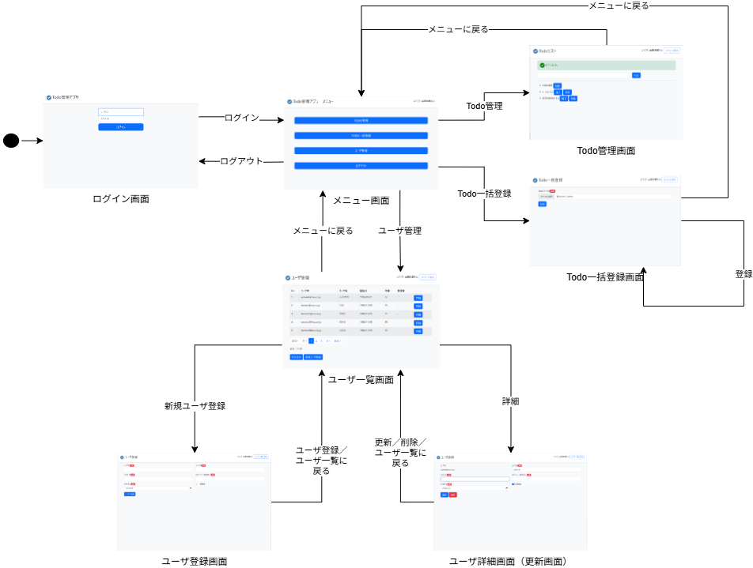

# Vue.jsとTailwind CSSを使ったSPAサンプルAP

> [!WARNING]
> 現在、作成中です。

- SPAのサンプルAPです。Vue.jsのプロジェクトを作成し、Tailwind CSSを導入しています。

- Vue.jsやReactのようなSPAのフレームワークを使ったコンポーネント指向の開発は、従来のサーバレンダリング・MPAの開発とは異なります。

- また、CSSは従来、セマンティックなクラス名を使ってスタイリングを行っており、CSSフレームワークのBootstrapもどちらかというとセマンティックな考え方がメインですが、Tailwind CSSは、ユーティリティファーストの考え方にもとづき、ユーティリティクラスを使ってスタイリングを行い、コンポーネントレベルの抽象化は、Vue.jsやReactのコンポーネントで行うという考え方になっています。

- このサンプルAPでは、2つの考え方の違いによる実装を比較するため、[Spring Boot + Thymeleaf + BootstrapのサンプルAP](https://github.com/mysd33/sample-bff/)と同じ画面を作成して、ソースコードを比較できるようにしてみようと思います。

## サンプルAPの動作確認方法

- 開発用サーバーの起動

```sh
npm run dev
```

- ブラウザで[http://localhost:5173/](http://localhost:5173/)アクセス

## 画面一覧

> [!WARNING]
> 現在、作成中です。Vue.jsとTailwind CSSを使ったSPAの画面は、まだモックアップレベルの実装なので、比較の際、注意してください。


- 作成している画面は以下の通り。

| 画面名 | 説明 | 画面イメージ | Vue+TailWindソースコード | （参考比較）Thymeleaf+Bootstrapソースコード |
| ---- | ---- | ---- | ---- | ---- |
| ログイン画面 | トップページの画面で、ユーザがログインするための画面。 | [画面](docs/img/screen/screen1.png) | [ソースコード](src/views/LoginView.vue) | [ソースコード](https://github.com/mysd33/sample-bff/blob/main/src/main/resources/templates/login/login.html) |
| メニュー画面 | メニュー画面。ログインユーザのロールによって管理者メニューの表示有無が切り替わる。 | [画面](docs/img/screen/screen2.png) | [ソースコード](src/views/MenuView.vue) | [ソースコード](https://github.com/mysd33/sample-bff/blob/main/src/main/resources/templates/menu/menu.html) |
| Todo管理画面 | Todoリストの一覧表示、登録、完了、削除といった操作を実施できる画面。 | [画面](docs/img/screen/screen3.png)  | [ソースコード](src/views/TodoListView.vue) | [ソースコード](https://github.com/mysd33/sample-bff/blob/main/src/main/resources/templates/todo/todoList.html) |
| Todo一括登録画面 | Todoリストを記載したCSVファイルをアップロードし、非同期でTodoリストを登録できる画面。 |  |  |  |
| ユーザ一覧画面 | 登録されているユーザを一覧表示&CSVファイルダウンロードできる画面。 |  |  |  |
| ユーザ登録画面 | ユーザを新規登録するための画面。 |  |  |  |
| ユーザ詳細画面 | ユーザの詳細情報の表示と情報更新するための画面。 |  |  |  |

## 画面遷移図

- 現在、作成中のため、全ての画面はありません。



## 画面部品
- 画面部品の[src/components/](src/components/)フォルダに入っています。

| 画面部品 | 説明 | ソースコード |
| ---- | ---- | ---- |
| ヘッダ領域 | 画面ヘッダー部分の表示領域| [ソースコード](src/components/HeaderArea.vue) |
| メイン領域 | メインの表示利用域 | [ソースコード](src/components/MainContainer.vue) |
| テキスト入力 | テキスト入力部品 | [ソースコード](src/components/InputText.vue) |
| パスワード入力 | パスワード入力部品 | [ソースコード](src/components/InputPassword.vue) |
| TBD: 今後追加予定 |  |  |
| テキスト入力（ログイン画面用） | ログイン画面のレイアウトに合わせたテキスト入力部品 | [ソースコード](src/components/LoginInputText.vue) |
| パスワード入力（ログイン画面用） | ログイン画面のレイアウトに合わせたパスワード入力部品 | [ソースコード](src/components/LoginInputPassword.vue) |
| 送信ボタン | フォームの送信ボタン | [ソースコード](src/components/SubmitButton.vue) |
| メニュー用ボタン | メニュー画面用のボタン | [ソースコード](src/components/MenuButton.vue) |


## 追加したプラグイン・ライブラリ
- Vueライブラリ
    - [vue-router](https://router.vuejs.org/)
    - [pinia](https://pinia.vuejs.org/)        
    - [@heroicons/vue](https://github.com/tailwindlabs/heroicons?tab=readme-ov-file#vue)

- テストツール
    - [Vitest](https://vitest.dev/)
    - [Cypress]()

- TailWind CSSプラグイン
    - [@tailwindcss/forms](https://www.cypress.io/)

## (参考) ブランクプロジェクトのセットアップ方法
- Vue.jsとTailwind CSSを使ったブランクプロジェクトの作成手順は以下の通り

```sh
# vue-cliを使ってプロジェクトを作成
npm create vue@latest

Project name: ... sample-vue-tailwind
Add TypeScript? ... Yes
Add JSX Support? ... No
Add Vue Router for Single Page Application development? ... Yes
Add Pinia for state management? ... Yes
Add Vitest for Unit Testing? ... Yes
Add an End-to-End Testing Solution? » Cypress
Add ESLint for code quality? » Yes
Add Prettier for code formatting? ... Yes

# プロジェクトのディレクトリに移動
cd sample-vue-tailwind

# Tailwind CSS等のインストール
npm install -D tailwindcss postcss autoprefixer

# tailwind.config.js、postcss.config.jsの作成
npx tailwindcss init -p
```

- tailwind.config.jsにコンテンツの指定を追加

```js
/** @type {import('tailwindcss').Config} */
export default {
  content: ['./index.html', './src/**/*.{vue,js,ts,jsx,tsx}'],
  theme: {
    extend: {},
  },
  plugins: [],
}
```

- style.cssを追加
    - ./src/style.cssを追加

```css
@tailwind base;
@tailwind components;
@tailwind utilities;
```

- ./src/main.tsにstyle.cssを読み込む処理を追加

```ts
import './assets/main.css'
…
// 追加
import '@/style.css'

const app = createApp(App)
…
```
